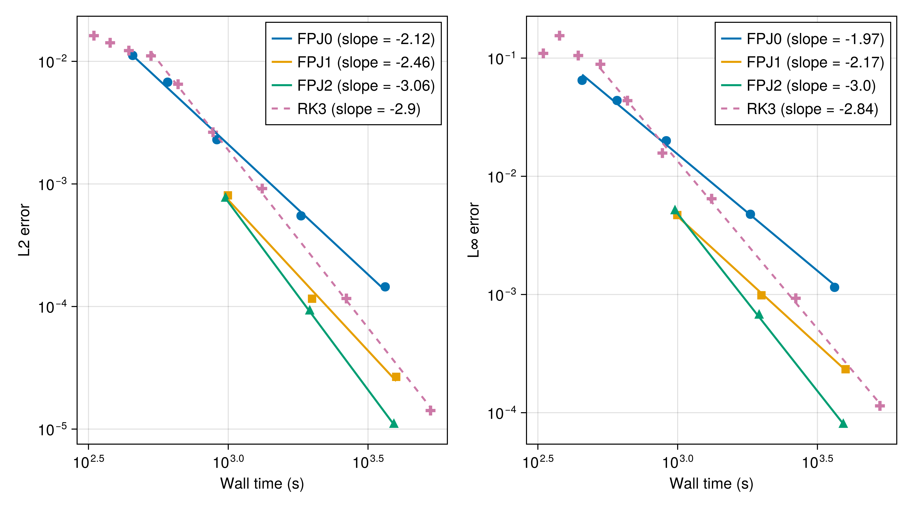
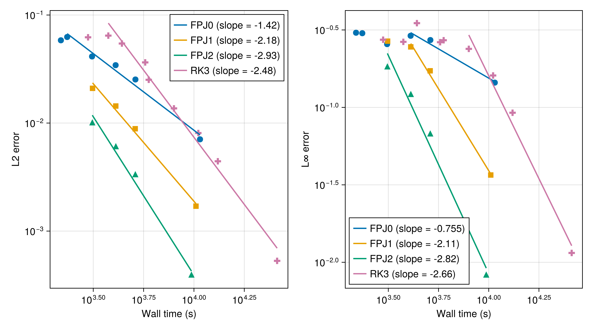

# Fast Pressure-Projection RK3 Shear-Flow Experiments

This repository contains the simulation and plotting scripts used for the final project on fast pressure-projection variants of the low-storage RK3 time stepper in Oceananigans.jl.
The aim is to compare the standard RK3 method, which solves a pressure Poisson equation at every substage, with three fast projection methods that use pressure extrapolation so that only one Poisson solve is required per time step.

The three fast projection variants are:

- `:ConstantPressureProjectionRungeKutta3`, corresponding to FPJ-0.
- `:LinearPressureProjectionRungeKutta3`, corresponding to FPJ-1.
- `:MidpointPressureProjectionRungeKutta3`, corresponding to FPJ-2.

See there [pull request in Oceananigans.jl](https://github.com/CliMA/Oceananigans.jl/pull/5059) which implements these methods for technical details.

The experiments use a horizontal shear layer in a unit cube, first on a regular domain and then over a staircase immersed-boundary bottom topography.
For each case, the scripts run the convergence experiment, save visualization data, benchmark wall-clock runtime, and then make the figures used in the manuscript.

## Scripts

- `run_lm_shear_flow.jl` runs the regular-domain convergence sweep, reference run, visualization run, and timing benchmark.
- `plot_lm_shear_flow.jl` loads a saved regular-domain run and makes the convergence, visualization, and runtime figures.
- `run_lm_shear_flow_staircase.jl` runs the same experiment over the staircase immersed-boundary domain, preserving the FFT-preconditioned CG pressure solver.
- `plot_lm_shear_flow_staircase.jl` loads a saved staircase run and makes the corresponding figures.

## Runtime convergence

The runtime-convergence plots generated by the scripts compare the final-time velocity error of each method against the wall-clock runtime needed to reach that error.

In the regular-domain case, the pressure solve is not the dominant cost on the benchmarked single GPU, so the standard RK3 and fast projection methods have similar runtimes.
In the staircase immersed-boundary case, the pressure solve dominates the per-substep cost; FPJ-2 is therefore substantially faster than standard RK3 at tight error tolerances, while FPJ-0 is most efficient at looser tolerances.
The trade-off is that the fast projection methods are less stable at larger CFL numbers.

### Regular shear flow

### Staircase immersed-boundary shear flow

